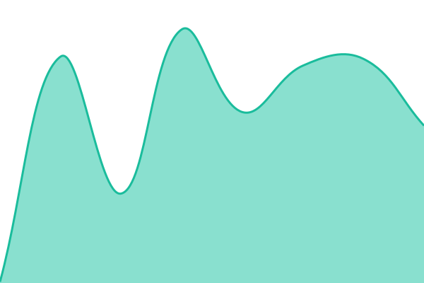

# [📈 Live Status](https://status.bascribe.com): <!--live status--> **🟩 All systems operational**

This repository contains the open-source uptime monitor and status page for [BA-BlockchainAnalysis](https://status.bascribe.com), powered by [Upptime](https://github.com/upptime/upptime).

With [Upptime](https://upptime.js.org), you can get your own unlimited and free uptime monitor and status page, powered entirely by a GitHub repository. We use [Issues](https://github.com/BA-BlockchainAnalysis/bascribe-status/issues) as incident reports, [Actions](https://github.com/BA-BlockchainAnalysis/bascribe-status/actions) as uptime monitors, and [Pages](https://status.bascribe.com) for the status page.

<!--start: status pages-->
<!-- This summary is generated by Upptime (https://github.com/upptime/upptime) -->
<!-- Do not edit this manually, your changes will be overwritten -->
<!-- prettier-ignore -->
| URL | Status | History | Response Time | Uptime |
| --- | ------ | ------- | ------------- | ------ |
|  [BAScribe](https://bascribe.com) | 🟩 Up | [ba-scribe.yml](https://github.com/BA-BlockchainAnalysis/bascribe-status/commits/HEAD/history/ba-scribe.yml) | 

 1225ms
     
 | 

<a href="https://status.bascribe.com/history/ba-scribe">100.00%</a>
    

|  [App health](https://bascribe.com/api/health) | 🟩 Up | [app-health.yml](https://github.com/BA-BlockchainAnalysis/bascribe-status/commits/HEAD/history/app-health.yml) | 

 1225ms
     
 | 

<a href="https://status.bascribe.com/history/app-health">100.00%</a>
    

|  [API v1](https://bascribe.com/api/v1/me) | 🟩 Up | [api-v1.yml](https://github.com/BA-BlockchainAnalysis/bascribe-status/commits/HEAD/history/api-v1.yml) | 

 249ms
     
 | 

<a href="https://status.bascribe.com/history/api-v1">100.00%</a>
    

|  [Polygon RPC (anchoring)](https://polygon-bor-rpc.publicnode.com) | 🟩 Up | [polygon-rpc-anchoring.yml](https://github.com/BA-BlockchainAnalysis/bascribe-status/commits/HEAD/history/polygon-rpc-anchoring.yml) | 

 150ms
     
 | 

<a href="https://status.bascribe.com/history/polygon-rpc-anchoring">100.00%</a>
    

|  [Open-source verifier](https://github.com/BA-BlockchainAnalysis/scribe-verify) | 🟩 Up | [open-source-verifier.yml](https://github.com/BA-BlockchainAnalysis/bascribe-status/commits/HEAD/history/open-source-verifier.yml) | 

 891ms
     
 | 

<a href="https://status.bascribe.com/history/open-source-verifier">100.00%</a>
    

<!--end: status pages-->

[**Visit our status website →**](https://status.bascribe.com)

## 📄 License

- Powered by: [Upptime](https://github.com/upptime/upptime)
- Code: [MIT](./LICENSE) © [Anand Chowdhary](https://anandchowdhary.com)
- Data in the `./history` directory: [Open Database License](https://opendatacommons.org/licenses/odbl/1-0/)
